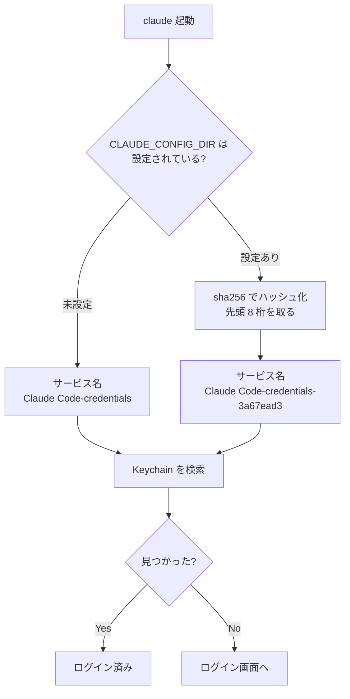
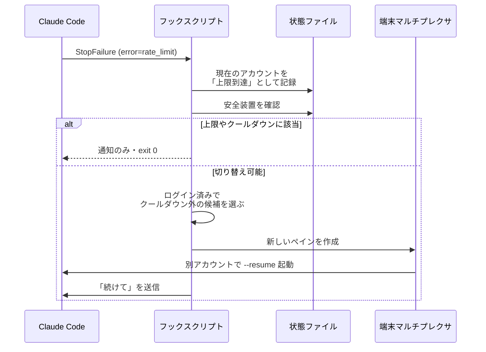
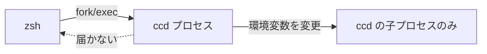

## ※ 複数アカウントの運用について

:::message
1 台のマシンで複数の Claude Code アカウントを使い分ける行為は、契約しているプランの利用規約に抵触する場合があります。本記事で扱うのは「会社アカウントと個人アカウントを 1 台の Mac で使い分ける」という運用であり、レートリミットの回避を目的とした複数契約の取得を推奨するものではありません。ご自身が契約しているプランの規約を確認のうえ、自己責任でご利用ください。
:::

## TL;DR

:::message
**`CLAUDE_CONFIG_DIR` でアカウントを分けたのに、既定のアカウントが突然「未ログイン」になるのはなぜ?**

→ **macOS の Keychain サービス名が `CLAUDE_CONFIG_DIR` の文字列から導出されるため。「未設定」と「既定パスを明示」は別物として扱われる**

1. `CLAUDE_CONFIG_DIR` が未設定なら、サービス名は `Claude Code-credentials`
2. 設定されていると `Claude Code-credentials-<sha256(パス) の先頭 8 桁>` になる
3. つまり `CLAUDE_CONFIG_DIR=$HOME/.claude` と**既定のパスをわざわざ書く**と、存在しない Keychain 項目を探しに行く
4. 既定アカウントを使うときは、環境変数を**設定しない**のが唯一の正解

**その他の重要ポイント:**
- ハッシュ対象は環境変数の文字列そのもの。末尾スラッシュや `~` 未展開でも別項目になる
- Linux では設定ディレクトリ内の `.credentials.json` なので、この問題は起きない
- レートリミット検知は `StopFailure` フックを `matcher: "rate_limit"` で絞れる。ただし**このフックは出力も終了コードも無視される**
:::

## 2 つのアカウントを 1 台で使いたい

会社の契約と個人の契約、両方で Claude Code を使いたい。けれど公式にはアカウント切り替えのコマンドがなく、`/login` のたびにブラウザ認証をやり直すことになります。

調べると、`CLAUDE_CONFIG_DIR` という環境変数で設定ディレクトリごと分ける方法が定番として出てきます。設定も履歴も認証情報もこのディレクトリ配下に置かれるので、ディレクトリを分ければアカウントも分かれる、という理屈です。

素直に、シェルにエイリアスを 2 つ用意しました。

```bash:~/.zshrc
alias claude1='CLAUDE_CONFIG_DIR=$HOME/.claude claude'
alias claude2='CLAUDE_CONFIG_DIR=$HOME/.claude-account2 claude'
```

`claude2` は問題なく動きます。ところが `claude1` — つまり**今まで普通に使えていた既定のアカウント** — を起動すると、ログイン画面が出ました。

`~/.claude` は消えていません。設定も履歴もそのままです。それなのに未ログイン扱いになる。

> 同じディレクトリを指しているのに、なぜ?

## 認証情報はディレクトリの中にない

種明かしをすると、macOS では認証情報が設定ディレクトリの中に置かれていません。Keychain に入っています。

そして Keychain のサービス名が、設定ディレクトリによって変わります。



ポイントは分岐が「パスが違うか」ではなく、**「環境変数が設定されているか」**で切られていることです。

`~/.claude` にログインしたときは環境変数が未設定だったので、認証情報は `Claude Code-credentials` という名前で保存されました。あとから `CLAUDE_CONFIG_DIR=$HOME/.claude` と明示すると、同じディレクトリを指していても「設定あり」の分岐に落ちて、`Claude Code-credentials-708263eb` という**まだ存在しない項目**を探しに行きます。見つからないので未ログイン、というわけです。

### 手元で確認してみる

推測ではなく、実際に確認できます。サービス名は自分で計算できるので、Keychain に問い合わせるだけです。

```bash
# 自分の設定ディレクトリに対応する Keychain のサービス名を計算する
dir="$HOME/.claude-account2"
service="Claude Code-credentials-$(printf '%s' "$dir" | shasum -a 256 | cut -c1-8)"
echo "$service"

# その名前の項目が Keychain にあるか調べる（値は表示されません）
security find-generic-password -s "$service" >/dev/null 2>&1 \
  && echo "見つかった" || echo "なし"
```

実行結果:

```
Claude Code-credentials-3a67ead3
見つかった
```

`CLAUDE_CONFIG_DIR=$HOME/.claude-account2` でログイン済みなので、ハッシュ付きの名前で見つかります。

では、既定ディレクトリを明示した場合はどうなるか。同じスクリプトの `dir` を `$HOME/.claude` に変えて実行します。

```
Claude Code-credentials-708263eb
なし
```

一方、suffix なしの名前で探すと、こちらは存在します。

```bash
security find-generic-password -s "Claude Code-credentials" >/dev/null 2>&1 \
  && echo "見つかった" || echo "なし"
# => 見つかった
```

同じ `~/.claude` に対して、**環境変数の有無だけで参照先が変わっている**ことがはっきりします。

:::message alert
`security find-generic-password` は Keychain の項目を検索するコマンドです。上のコマンドは `-w` を付けていないので値（トークン）は表示されませんが、`-w` を付けると認証トークンが平文で出力されます。ログや共有画面に流さないよう注意してください。
:::

### 正しい書き方

既定アカウントには環境変数を**付けない**。これが唯一の正解です。

```bash:~/.zshrc
# ❌ 危険: 同じパスなのに別の Keychain 項目を見に行く
alias claude1='CLAUDE_CONFIG_DIR=$HOME/.claude claude'

# ✅ 正しい: 変数を明示的に外す
alias claude1='env -u CLAUDE_CONFIG_DIR claude'
alias claude2='CLAUDE_CONFIG_DIR=$HOME/.claude-account2 claude'
```

`env -u` を使っているのは、別アカウントのシェルから起動されたときに変数が残っていることがあるためです。単に「書かない」だけでは、継承された値がそのまま効いてしまいます。

## `~/.claude` を symlink で差し替えてはいけない

この手法を紹介する記事のなかには、シンボリックリンクで `~/.claude` 自体を差し替えるものがあります。

```bash
# ⚠️ 実行しないでください
alias claude-work='ln -sfn ~/.claude-work ~/.claude && CLAUDE_CONFIG_DIR=~/.claude-work claude'
```

`~/.claude` は認証情報の置き場所ではなく、**Skills、rules、agents、セッション履歴の実体**が入っているディレクトリです。ここを symlink に置き換えると、それまでの資産が参照できなくなります。すでに `CLAUDE_CONFIG_DIR` で参照先が切り替わっているので、そもそもリンクを張る必要もありません。

共有したい資産がある場合は、逆向きにリンクを張ります。

```bash
# 追加したアカウントから、既定アカウントの資産を参照する
for item in skills rules agents commands CLAUDE.md; do
  ln -s "$HOME/.claude/$item" "$HOME/.claude-work/$item"
done
```

設定ディレクトリはアカウントごとに完全に独立しているので、MCP サーバーの定義も引き継がれません。`~/.claude.json` の `mcpServers` を手でマージするか、後述のツールに任せることになります。

## レートリミットで止まったら別アカウントに移りたい

ここからが本題です。アカウントを分けられたので、次は「使用上限に達したら、もう一方の契約で作業を続ける」を自動化したくなります。

Claude Code にはフック機構があり、`StopFailure` というイベントが使えます[^2]。応答が止まったときに発火し、標準入力に JSON が渡されます。

```json
{
  "hook_event_name": "StopFailure",
  "error": "rate_limit",
  "session_id": "cb15151d-9fd0-48a8-8c61-34b756b2fba4",
  "cwd": "/path/to/project"
}
```

ありがたいことに、`StopFailure` はエラーの種類ごとに分類されていて、`matcher` で絞り込めます。公式ドキュメントには次の値が挙げられています[^2]。

```
rate_limit, overloaded, authentication_failed, oauth_org_not_allowed,
billing_error, invalid_request, model_not_found, server_error,
max_output_tokens, unknown
```

エラーメッセージの英文を正規表現で当てにいく必要はありません。

切り替えの対象にすべきは `rate_limit` だけです。`overloaded` や `server_error` は容量側の問題なので、アカウントを変えても同じように失敗します。

```json:~/.claude/settings.json
{
  "hooks": {
    "StopFailure": [
      {
        "matcher": "rate_limit",
        "hooks": [
          { "type": "command", "command": "ccd hook rate-limit" }
        ]
      }
    ]
  }
}
```

処理の流れはこうなります。



### 実行中のセッションは切り替えられない

ひとつ制約があります。**動いているセッションのアカウントは変更できません。**

環境変数はプロセス起動時に読まれるので、起動後に書き換えても効きません。したがって「切り替える」の実体は「別アカウントで新しいプロセスを起こす」ことになります。会話を引き継ぎたければ `--resume <session_id>` を渡します。

ところがセッション履歴も設定ディレクトリごとに独立しているため、そのままでは切り替え先から見えません。ここは、対象のセッションファイル 1 個だけを symlink するのが安全です。

```bash
# 履歴ディレクトリ全体ではなく、そのセッションだけを渡す
key=$(pwd | sed 's|/|-|g; s|\.|-|g')
mkdir -p "$HOME/.claude-work/projects/$key"
ln -s "$HOME/.claude/projects/$key/$SESSION_ID.jsonl" \
      "$HOME/.claude-work/projects/$key/"
```

履歴ディレクトリごと共有してしまうと、2 つのアカウントの会話が混ざります。1 ファイルだけリンクすれば、引き継ぎたい会話だけが移動します。

### 無限ループを止める仕掛けが要る

コーディングエージェントの自動切り替えは、放っておくと永久に回ります。切り替え先も上限に達したら、そこでまたフックが発火するからです。

安全装置は最初から入れておくべきです。実装した内容は次の 4 つです。

| 設定項目 | 既定値 | 目的 |
|---|---|---|
| `mode` | `notify` | `auto` / `notify` / `off`。既定は通知のみ |
| `cooldownMinutes` | 60 分 | 上限に達したアカウントを候補から外す時間 |
| `minIntervalMinutes` | 5 分 | 同一セッションで再切り替えするまでの最短間隔 |
| `maxSwitchesPerHour` | 4 回 | 全体の上限。暴走を止める最後の砦 |

既定を `notify`（通知のみ）にしているのは、いきなり全自動にすると挙動が読めないためです。しばらく通知で様子を見て、納得してから `auto` に上げる想定にしています。

実際に安全装置が効いているかは、偽のペイロードを流し込めば確認できます。

```bash
payload='{"hook_event_name":"StopFailure","error":"rate_limit","session_id":"S1","cwd":"'$PWD'"}'
echo "$payload" | ccd hook rate-limit
echo "$payload" | ccd hook rate-limit   # 同じセッションで 2 回目
```

出力:

```
{"systemMessage":"Rate limit detected. Launched work with none."}
{"systemMessage":"Rate limit detected, but minimum switch interval has not elapsed."}
```

2 回目が最短間隔で弾かれています。

### `StopFailure` の出力は捨てられる

ここで注意が要ります。上の JSON は**手で実行したときにしか見えません**。

公式ドキュメントには、`StopFailure` について次のように書かれています[^2]。

| Hook event | Can block? | What happens on exit 2 |
|---|---|---|
| `StopFailure` | No | Output and exit code are ignored |

つまり `systemMessage` を返しても、ユーザーの画面には出ません。フックの終了コードも見られていないので、「exit 0 で終える」ことすら本来は気にしなくてよい設計になっています。

そうすると、自動切り替えが起きたことをどうやって知らせるかが問題になります。残る経路は 2 つです。

ひとつは OS の通知。もうひとつは、フックが何をしたかを自分で記録しておいて、後から読めるようにすることです。

```bash
$ ccd hook status
installed (/Users/you/.claude/settings.json)
last event: 2026-07-29T05:29:16.677Z [suggested] Rate limit detected.
  Suggested account: work. Command: CLAUDE_CONFIG_DIR='/Users/you/.claude-work' 'claude'
```

「出力が無視される」という一行を読み飛ばすと、通知が来ないのに原因が分からない、という状態になります。

## もうちょっと深掘ってみた

ここからは、設定ディレクトリの解決や Keychain のサービス名の導出といった内部の挙動について掘り下げていきます。

:::message alert
`CLAUDE_CONFIG_DIR` は Claude Code の公式ドキュメントに記載がありません[^3]。以下の内容は手元での実測から導いたもので、将来のバージョンで変わる可能性があります。本記事の実行結果は Claude Code 2.1.220 / macOS 15 時点のものです。
:::

### ハッシュの対象は「パス」ではなく「環境変数の文字列」

サービス名の suffix は、正規化されたパスではなく、**環境変数に入っている文字列そのもの**から計算されます。これは実害のある挙動です。

同じディレクトリを指していても、書き方が違えば別の項目になります。

| `CLAUDE_CONFIG_DIR` の値 | 実際に指すディレクトリ | Keychain の項目 |
|---|---|---|
| （未設定） | `~/.claude` | `Claude Code-credentials` |
| `/Users/you/.claude` | `~/.claude` | `Claude Code-credentials-<hash A>` |
| `/Users/you/.claude/` | `~/.claude` | `Claude Code-credentials-<hash B>` |
| `~/.claude` | シェルが展開しなければ文字列のまま | `Claude Code-credentials-<hash C>` |

末尾のスラッシュ 1 文字で、別のアカウント扱いになります。設定ファイルに書くときは、パスの表記を固定しておかないと、ある日突然ログインし直しになります。

3 行目の `~/.claude` は特に厄介です。シェルのクォート次第でチルダが展開されないことがあり、その場合は `~/.claude` という文字列がそのままハッシュされます。

```bash
# チルダが展開される
export CLAUDE_CONFIG_DIR=~/.claude-work

# チルダが展開されない（文字列 "~/.claude-work" が入る）
export CLAUDE_CONFIG_DIR="~/.claude-work"
```

この 2 つは別のアカウントになります。設定ディレクトリの位置としては前者が正しく、後者はカレントディレクトリからの相対パスとして扱われます。

### 設定ファイルだけディレクトリの外にある

もうひとつ紛らわしいのが、グローバル設定 JSON の位置です。

| `CLAUDE_CONFIG_DIR` | 設定ファイルの場所 |
|---|---|
| 未設定 | `~/.claude.json`（`~/.claude` の**外**） |
| `~/.claude-work` | `~/.claude-work/.claude.json`（ディレクトリの**中**） |

既定のときだけホーム直下に置かれ、カスタムディレクトリのときは中に入ります。「設定ディレクトリの中を探せばいい」と思い込んでいると、既定アカウントの情報だけ取れません。

規則としては「`CLAUDE_CONFIG_DIR` があればそこ、なければホームディレクトリ」に `.claude.json` を置く、と理解すると一貫します。既定ディレクトリ `~/.claude` は、この規則の分母には出てこないわけです。

ちなみに、ログイン中のアカウントはこのファイルの `oauthAccount` から読めます。

```bash
# 既定アカウントのログイン先を確認する
jq -r '.oauthAccount.emailAddress' ~/.claude.json
```

### Linux ではこの問題が起きない

macOS 以外では、認証情報が設定ディレクトリ内の `.credentials.json` に平文で保存されます。

```
~/.claude-work/.credentials.json
```

パスが設定ディレクトリから直接決まるので、環境変数の書き方で参照先がずれることはありません。今回のハマりどころは Keychain を使う macOS 固有のものです。

裏を返すと、Linux では認証トークンがファイルとして存在します。バックアップツールや同期ツールの対象範囲には注意が必要です。

### なぜ「切り替え」はシェル関数でないと実装できないのか

最後に、CLI ツールとして作るときの制約に触れておきます。

`ccd use work` のような「現在のシェルのアカウントを切り替える」コマンドは、**バイナリだけでは実装できません**。プロセスは自分の子プロセスの環境変数しか変更できず、親であるシェルの環境は触れないからです。



そのため、`use` だけはシェル関数として実装し、バイナリには「シェルが評価すべきコード」を出力させます。`nvm` や `zoxide` が同じ構造をとっています。

```bash
ccd() {
  if [ "$1" = "use" ]; then
    eval "$(command ccd use "${@:2}")"   # ← 標準出力を eval する
  else
    command ccd "$@"
  fi
}
```

この設計をとる場合、**標準出力を絶対に汚してはいけません**。確認メッセージを `echo` で出すと、それがシェルコマンドとして評価されます。人間向けの出力は標準エラーに逃がします。

```bash
# バイナリ側の出力
export CLAUDE_CONFIG_DIR='/Users/you/.claude-work'   # ← stdout (eval される)
ccd: now using work → ~/.claude-work (you@work.example)  # ← stderr (人間が読む)
```

解決に失敗したときも同様です。標準出力に何か出してしまうと、壊れたコードが `eval` されます。エラー時は標準出力を空にして、終了コードだけで伝えます。

## 作ったもの

以上をまとめて `ccd` という CLI にしました。npm で公開しています。

```bash
npm install -g claude-ccd
```

:::message
**前提:** Node.js 18.17 以上と、インストール済みの Claude Code CLI が必要です。対応 OS は macOS と Linux です。
:::

シェル統合を有効にします。

```bash:~/.zshrc
eval "$(ccd shell-init zsh)"
```

```bash
$ ccd list
   NAME     CONFIG DIR         ACCOUNT (email)      PLAN   LOGIN
*  default  ~/.claude          you@example.com      max    ok
   work     ~/.claude-work     you@work.example     pro    ok

$ ccd use work
ccd: now using work → ~/.claude-work (you@work.example)
```

アカウントは名前でも、メールアドレスの部分一致でも指定できます。`ccd doctor` は今回のハマりどころ — 既定ディレクトリを `CLAUDE_CONFIG_DIR` で明示していないか — も検査します。

```bash
$ ccd doctor
OK claude binary: claude
OK login default: you@example.com
OK login work: you@work.example
OK shell integration: CCD_SHELL_INTEGRATION
OK StopFailure hook: settings.json
OK default env trap: CLAUDE_CONFIG_DIR must be unset for default account
```

自動切り替えのフックは任意です。まずは通知のみで入れられます。

```bash
ccd hook install --mode notify
```

リポジトリはこちらです[^1]。依存パッケージはゼロで、Node.js の標準モジュールだけで動きます。

## まとめ

### 理解チェック

**Q1**: `CLAUDE_CONFIG_DIR=$HOME/.claude claude` と `claude` は、同じディレクトリを使うのに結果が違います。なぜ?

<details>
<summary>答えを見る</summary>

macOS の Keychain サービス名が、環境変数の**有無**で分岐するためです。未設定なら `Claude Code-credentials`、設定されていれば `Claude Code-credentials-<sha256 の先頭 8 桁>` になります。既定パスを明示すると後者の分岐に入り、まだ存在しない項目を探すので未ログイン扱いになります。

</details>

**Q2**: 設定ディレクトリを変えたら、Skills や MCP サーバーの設定も引き継がれますか?

<details>
<summary>答えを見る</summary>

引き継がれません。設定ディレクトリはアカウントごとに完全に独立しています。Skills や rules は symlink で共有し、MCP サーバーの定義は `.claude.json` の `mcpServers` をマージする必要があります。

</details>

**Q3**: 動いているセッションの途中でアカウントを切り替えられますか?

<details>
<summary>答えを見る</summary>

できません。環境変数はプロセス起動時に読まれるためです。切り替えとは実質「別アカウントで新しいプロセスを起こす」ことで、会話を続けたい場合は `--resume <session_id>` を使い、対象のセッションファイルを切り替え先の設定ディレクトリから参照できるようにします。

</details>

:::message
**最重要ポイント**
1. 既定アカウントを使うときは `CLAUDE_CONFIG_DIR` を**設定しない**。`env -u` で明示的に外す
2. ハッシュ対象は環境変数の文字列そのもの。末尾スラッシュやチルダの展開漏れで別アカウントになる
3. `~/.claude` を symlink で差し替えない。そこには Skills と履歴の実体がある
4. 自動切り替えを組むなら、クールダウンと回数上限を最初から入れる
:::

## 参考

[^1]: [kanketsu-jp/claude-ccd - GitHub](https://github.com/kanketsu-jp/claude-ccd)
[^2]: [Hooks reference - Claude Docs](https://code.claude.com/docs/en/hooks.md) — `StopFailure` のマッチャー値と、出力・終了コードの扱い
[^3]: [Settings - Claude Docs](https://code.claude.com/docs/en/settings.md) / [Environment variables - Claude Docs](https://code.claude.com/docs/en/env-vars.md) — 2026 年 7 月時点で `CLAUDE_CONFIG_DIR` の記載は確認できず
